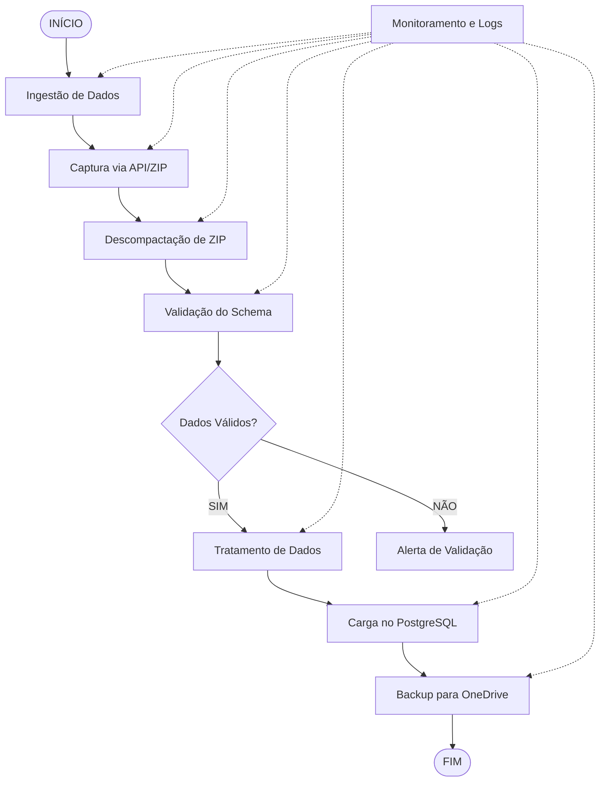

# Welcome to MkDocs

## Fluxograma

```mermaid
flowchart TD
    A([INÍCIO]) --> B[Ingestão de Dados]
    B --> C[Captura via API/ZIP]
    C --> D[Descompactação de ZIP]
    D --> E[Validação do Schema]
    E --> F{Dados Válidos?}
    F -->|SIM| G[Tratamento de Dados]
    F -->|NÃO| H[Alerta de Validação]
    G --> I[Carga no PostgreSQL]
    I --> J[Backup para OneDrive]
    J --> K([FIM])
    
    L[Monitoramento e Logs]
    L -.-> B
    L -.-> C
    L -.-> D
    L -.-> E
    L -.-> G
    L -.-> I
    L -.-> J
```

For full documentation visit [mkdocs.org](https://www.mkdocs.org).

